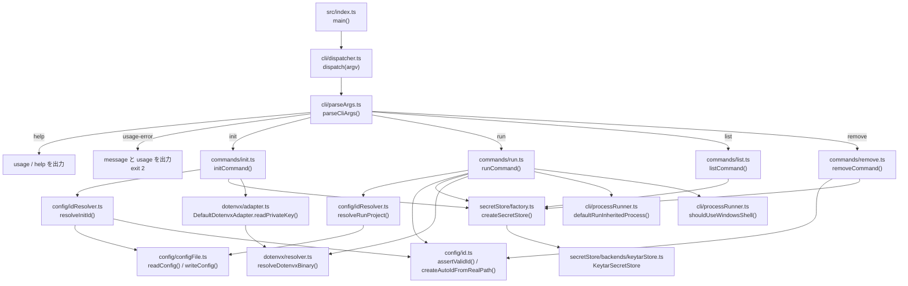
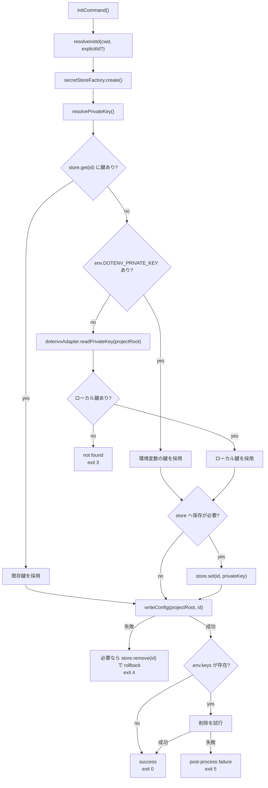
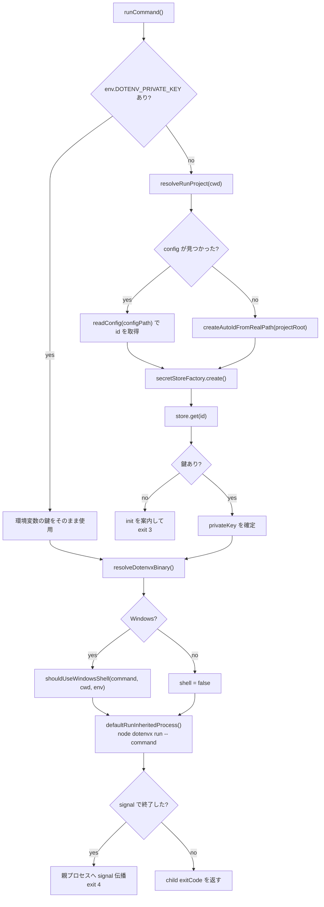
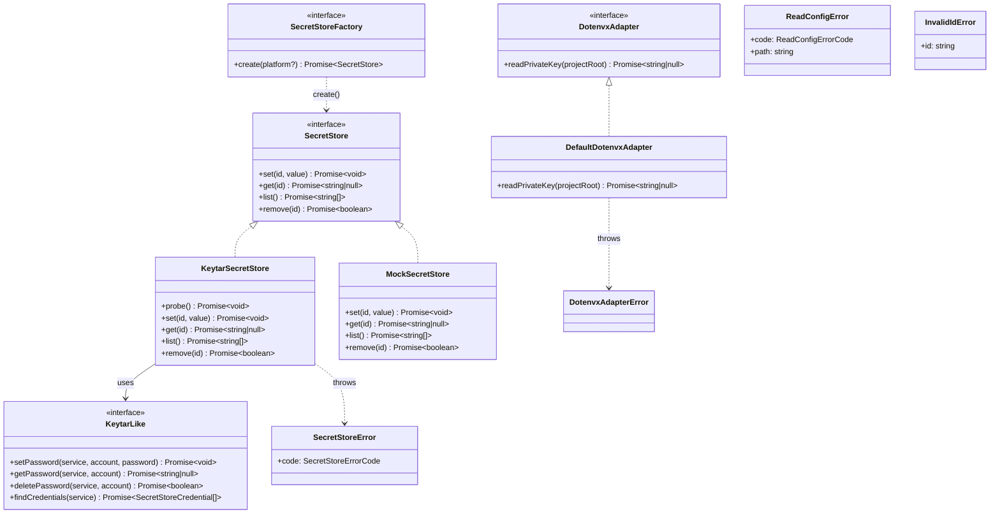

# src アーキテクチャ図

`src/` 配下の現在実装を、CLI 実行フローと主要な抽象に絞って整理したメモ。
主に `init` / `run` / `list` / `remove` の制御経路、設定ファイル解決、
Secret Store 抽象、`dotenvx` 連携の位置づけを把握するために使う。

## 対象範囲

- CLI entry point: [src/index.ts](../../src/index.ts)
- 引数解析と dispatch: [src/cli/parseArgs.ts](../../src/cli/parseArgs.ts), [src/cli/dispatcher.ts](../../src/cli/dispatcher.ts)
- command 本体: [src/commands/init.ts](../../src/commands/init.ts), [src/commands/run.ts](../../src/commands/run.ts), [src/commands/list.ts](../../src/commands/list.ts), [src/commands/remove.ts](../../src/commands/remove.ts)
- config / ID 解決: [src/config/configFile.ts](../../src/config/configFile.ts), [src/config/id.ts](../../src/config/id.ts), [src/config/idResolver.ts](../../src/config/idResolver.ts)
- Secret Store: [src/secretStore/interface.ts](../../src/secretStore/interface.ts), [src/secretStore/factory.ts](../../src/secretStore/factory.ts), [src/secretStore/backends/keytarStore.ts](../../src/secretStore/backends/keytarStore.ts)
- `dotenvx` 連携: [src/dotenvx/adapter.ts](../../src/dotenvx/adapter.ts), [src/dotenvx/resolver.ts](../../src/dotenvx/resolver.ts)

## 全体フロー

## `init` フロー

`initCommand()` は、ID 解決と鍵ソース解決を分けて扱う。
鍵の優先順位は次の通り。

1. 既存の Secret Store 内の鍵
2. 親プロセスの `DOTENV_PRIVATE_KEY`
3. ローカル `.env` / `.env.keys` から `dotenvx` 経由で読んだ鍵

## `run` フロー

`runCommand()` は、すでに `DOTENV_PRIVATE_KEY` が注入済みならそのまま使い、
未注入時だけ config 探索と Secret Store 解決に進む。

## 主要インターフェースと実装

## ディレクトリごとの責務

| ディレクトリ       | 主な責務                                                                   |
| ------------------ | -------------------------------------------------------------------------- |
| `src/cli/`         | 引数解析、command dispatch、終了コード、子プロセス起動、Windows シェル判定 |
| `src/commands/`    | CLI 契約を実行時処理へ変換する orchestration                               |
| `src/config/`      | `.dotenvx-keychain` の読み書き、ID 検証、自動 ID 生成、親ディレクトリ探索  |
| `src/dotenvx/`     | 同梱 `dotenvx` バイナリ解決とローカル鍵読取                                |
| `src/secretStore/` | OS Secret Store 抽象、backend 生成、`keytar` 実装、テスト用 mock           |

## 補足メモ

- `list` は Secret Store から ID を列挙し、重複除去後に昇順出力するだけの薄い command である。
- `remove` は ID バリデーション後に exact match で削除し、未存在時は `exit 3` を返す。
- `run` の Windows 分岐は `.cmd` / `.bat` のときだけ `shell = true` に切り替える。
- 自動 ID は実パスを正規化し、basename と SHA-256 由来の 12 桁ハッシュを組み合わせて生成する。
